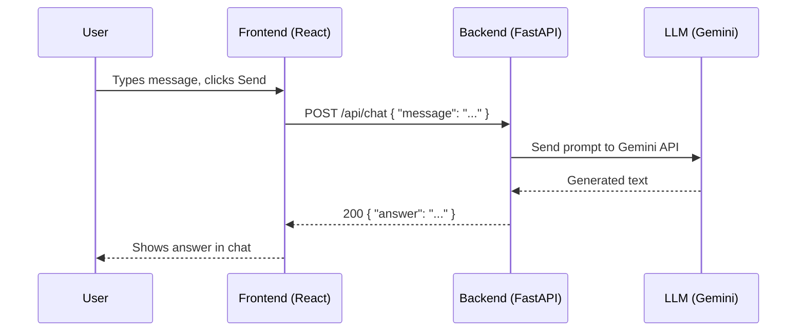

# Product Requirements Document: Basic AI Chat

| | |
|---|---|
| **Version** | 1.0 |
| **Status** | Draft |
| **Type** | Simple full-stack learning / starter project |

---

## 1. Overview

Basic AI Chat is a minimal chatbot web app. A user types a message in a React frontend, the frontend sends it to a FastAPI backend, the backend forwards it to Google's Gemini LLM, and the answer travels back to the user's screen.

The goal is to build the simplest possible end-to-end AI chat: no database, no login, no extras.

## 2. Goals and Non-Goals

### Goals
- Let a user send a text message and see an AI-generated answer.
- Keep the architecture simple: **Frontend → Backend → LLM → Backend → Frontend**.
- Keep the API contract tiny and clear (one endpoint).
- Keep the Gemini API key safe on the backend only.

### Non-Goals (for this version)
- User accounts or authentication
- Database or chat history persistence
- Multi-turn memory (each message is handled independently)
- Streaming responses
- File or image uploads
- Deployment, CI/CD, rate limiting, analytics

## 3. Target User

A developer or learner who wants a basic working AI chat to understand how frontend, backend, and an LLM connect. End users are anyone typing a question into the chat box.

## 4. System Architecture



## 5. Tech Stack

| Layer | Choice |
|---|---|
| Frontend | React + Vite + TypeScript |
| Backend | Python + FastAPI |
| LLM | Google Gemini (via the official `google-genai` Python SDK) |
| Data storage | None |
| Config | `.env` files |

## 6. Functional Requirements

### 6.1 Frontend

| ID | Requirement | Priority |
|---|---|---|
| FE-1 | A chat page with a message list and a text input with a Send button | Must |
| FE-2 | Pressing Enter also sends the message | Should |
| FE-3 | Show the user's message in the list immediately after sending | Must |
| FE-4 | Show a loading indicator ("Thinking...") while waiting for the answer | Must |
| FE-5 | Show the AI's answer in the list when it arrives | Must |
| FE-6 | Show a friendly error message if the request fails | Must |
| FE-7 | Disable the Send button while a request is in progress and when the input is empty | Must |
| FE-8 | Chat messages live in React state only (lost on page refresh) | Must |
| FE-9 | Use custom brand colors (Primary #CC3A63, Background #F9F0E0) and a rounded SVG logo | Must |
| FE-10 | Display timestamps for both user messages and AI responses | Must |

### 6.2 Backend

| ID | Requirement | Priority |
|---|---|---|
| BE-1 | Expose `POST /api/chat` | Must |
| BE-2 | Validate that `message` is a non-empty string (with a max length, e.g. 4,000 characters) | Must |
| BE-3 | Send the message to Gemini and return the text response as `answer` | Must |
| BE-4 | Read the Gemini API key and model name from environment variables | Must |
| BE-5 | Enable CORS for the frontend's origin (e.g. `http://localhost:5173`) | Must |
| BE-6 | Return clear error responses if validation or the LLM call fails | Must |
| BE-7 | Expose `GET /health` returning `{ "status": "ok" }` | Nice to have |

## 7. API Specification

### `POST /api/chat`

**Request**

```json
{
  "message": "explain me OS concepts"
}
```

**Success response: `200 OK`**

```json
{
  "answer": "An operating system (OS) is software that manages hardware and ..."
}
```

**Error responses**

| Status | When | Body |
|---|---|---|
| `422 Unprocessable Entity` | `message` missing, empty, or too long (FastAPI/Pydantic validation) | Default FastAPI validation error |
| `502 Bad Gateway` | Gemini API call failed or returned an unusable response | `{ "detail": "The AI service failed to respond." }` |
| `500 Internal Server Error` | Any other unexpected backend error | `{ "detail": "Something went wrong." }` |

### Data models (Pydantic)

```python
class ChatRequest(BaseModel):
    message: str = Field(min_length=1, max_length=4000)

class ChatResponse(BaseModel):
    answer: str
```

## 8. Non-Functional Requirements

- **Security:** The Gemini API key is stored only in the backend `.env` file. It is never sent to or bundled in the frontend. `.env` is git-ignored.
- **Performance:** Backend overhead should be minimal; total response time is dominated by Gemini (typically a few seconds). The UI must show a loading state so this never feels frozen.
- **Reliability:** The backend sets a timeout on the Gemini call so requests do not hang forever.
- **Simplicity:** No unnecessary libraries or layers. One endpoint, one service function for the LLM call.
- **Privacy:** No messages are stored on the server. (Note: messages are sent to Google's Gemini API.)

## 9. Configuration

**Backend `.env`**

```
GEMINI_API_KEY=your_key_here
GEMINI_MODEL=gemini-2.5-flash    # any Gemini model name; kept configurable
ALLOWED_ORIGIN=http://localhost:5173
```

**Frontend `.env`**

```
VITE_API_BASE_URL=http://localhost:8000
```

## 10. Suggested Project Structure

```
basic-ai-chat/
├── backend/
│   ├── app/
│   │   ├── main.py          # FastAPI app, CORS, routes
│   │   ├── schemas.py       # ChatRequest, ChatResponse
│   │   └── llm.py           # Gemini call wrapper
│   ├── requirements.txt
│   └── .env
└── frontend/
    ├── src/
    │   ├── App.tsx          # Chat UI
    │   ├── api.ts           # sendMessage() -> POST /api/chat
    │   ├── types.ts         # Message, ChatResponse types
    │   └── main.tsx
    ├── index.html
    ├── package.json
    └── .env
```

## 11. User Flow

1. User opens the app and sees an empty chat with an input box.
2. User types "explain me OS concepts" and presses Send.
3. The message appears in the chat; the input is cleared and disabled; "Thinking..." is shown.
4. Frontend calls `POST /api/chat`.
5. Backend validates the request, calls Gemini, and returns `{ "answer": "..." }`.
6. Frontend shows the answer in the chat and re-enables the input.
7. If anything fails, an error message is shown and the user can try again.

## 12. Acceptance Criteria

- [ ] `POST /api/chat` with a valid message returns `200` and a JSON body with a non-empty `answer`.
- [ ] `POST /api/chat` with an empty or missing `message` returns `422`.
- [ ] If the Gemini API fails (e.g. invalid key), the backend returns `502` and the UI shows an error message.
- [ ] The frontend shows the user's message, a loading state, and then the AI's answer.
- [ ] The frontend can be run with `npm run dev` and the backend with `uvicorn app.main:app --reload`, and they communicate without CORS errors.
- [ ] The Gemini API key does not appear anywhere in the frontend code or network requests from the browser.
- [ ] No database is used or required.

## 13. Milestones

| Step | Task |
|---|---|
| 1 | Set up FastAPI project, `/health` endpoint, and CORS |
| 2 | Add Gemini integration and the `POST /api/chat` endpoint; test with curl or Swagger UI (`/docs`) |
| 3 | Set up the Vite + React + TypeScript app |
| 4 | Build the chat UI and connect it to the backend |
| 5 | Add loading and error states, then manual end-to-end testing |
| 6 | Write a README with setup instructions |

## 14. Future Enhancements (Out of Scope Now)

- Conversation history sent with each request (multi-turn context)
- Persisting chats in a database
- Streaming responses (token by token)
- Markdown rendering of answers
- User authentication
- Rate limiting and usage limits
- Deployment (Docker, cloud hosting)

## 15. Risks and Assumptions

| Item | Note |
|---|---|
| Gemini API key and quota | You need a valid key; free-tier rate limits may cause occasional failures. The backend should surface these as `502`. |
| Model names change | Gemini model names are updated over time, so the model is set via `GEMINI_MODEL` instead of being hard-coded. |
| No memory | Because there is no database or history, each message is independent; follow-up questions like "explain more" will not have context. |
